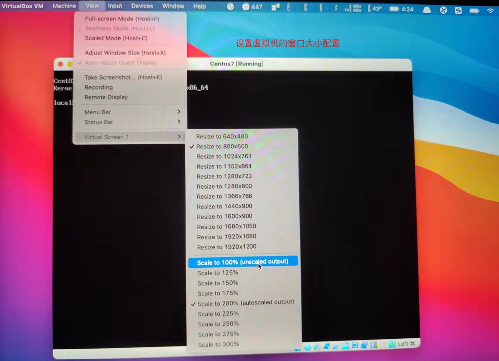

# 一、安装环境准备

下载系统镜像:可以在阿里云镜像站点下载 CentOS 

镜像: http://mirrors.aliyun.com/centos/7/isos/x86_64/CentOS-7-x86_64-DVD-1804.iso

创建虚拟机:步骤略。


# 二、操作系统安装
 为了统一环境，保证实验的通用性，将网卡名称设置为 eth*，不使用 CentOS 7 默认的网卡命名规则。所以需要在安装的时候，增加内核参数。
 
 ## 1)光标选择“Install CentOS 7”
 
  

 ## 2)点击 Tab，打开 kernel 启动选项后，增加 net.ifnames=0 biosdevname=0，如下图所示。
 
  

# 三、设置网络

## 1.vmware-workstation设置网络。

如果你的默认 NAT 地址段不是 192.168.56.0/24 可以修改 VMware Workstation 的配置，点击编辑 -> 虚拟 网络配置，然后进行配置。

  

## 2.vmware-fusion设置网络。

  

## 3.virtualbox设置网络。

  
    
  
  
  
  
  
  
  
       
  

# 四、系统配置

## 1.设置主机名
```
[root@localhost ~]# vi /etc/hostname 
linux-node1.example.com
或
#修改本机hostname
[root@localhost ~]# hostnamectl set-hostname linux-node1.example.com

#让主机名修改生效
[root@localhost ~]# su -l
Last login: Sun Sep 30 04:30:53 EDT 2018 on pts/0
[root@linux-node1 ~]#

#如何去掉centos下讨厌的169.254.0.0的静态路由
每次使用route -n命令查看路由的时候，总是能看见很烦人的169.254.0.0 这个静态路由的存在，看着烦啊，有什么办法不让它显示呢？方法很简单：
[root@localhost ~]# vim /etc/sysconfig/network
NETWORKING=yes
HOSTNAME=linux-node1.example.com
NOZEROCONF=yes

在/etc/sysconfig/network这个配置文件最后添加NOZEROCONF=yes就可以了
```

## 2.安装依赖
```
#为了保证各服务器间时间一致，使用ntpdate同步时间。
# 安装ntpdate
[root@linux-node1 ~]# yum install -y wget lrzsz vim net-tools openssh-clients ntpdate unzip xz telnet

$ 加入crontab
1 * * * *  (/usr/sbin/ntpdate -s ntp1.aliyun.com;/usr/sbin/hwclock -w) > /dev/null 2>&1
1 * * * * /usr/sbin/ntpdate ntp1.aliyun.com >/dev/null 2>&1

#设置时区
[root@linux-node1 ~]# yes | cp /usr/share/zoneinfo/Asia/Shanghai /etc/localtime
```

## 3.设置 IP 地址
  
  请配置静态 IP 地址。注意将 UUID 和 MAC 地址已经其它配置删除掉，便于进行虚 拟机克隆，请参考下面的配置。
```
[root@linux-node1 ~]# vim /etc/sysconfig/network-scripts/ifcfg-eth0 
TYPE=Ethernet
BOOTPROTO=static 
NAME=eth0 
DEVICE=eth0 
ONBOOT=yes 
IPADDR=192.168.56.11 
NETMASK=255.255.255.0 
#GATEWAY=192.168.56.1  注意这里不要配置网关，网关在eth1网卡配置，通过eth1走宿主机上外网

[root@linux-node1 ~]# vim /etc/sysconfig/network-scripts/ifcfg-eth1 
TYPE=Ethernet
PROXY_METHOD=none
BROWSER_ONLY=no
BOOTPROTO=dhcp
DEFROUTE=yes
IPV4_FAILURE_FATAL=no
IPV6INIT=yes
IPV6_AUTOCONF=yes
IPV6_DEFROUTE=yes
IPV6_FAILURE_FATAL=no
IPV6_ADDR_GEN_MODE=stable-privacy
NAME=eth1
DEVICE=eth1
ONBOOT=no
#这里是通过eth1网卡出外网

#重启网络服务
[root@linux-node1 ~]# systemctl restart network

#路由信息如下
[root@localhost ~]# route -n
Kernel IP routing table
Destination     Gateway         Genmask         Flags Metric Ref    Use Iface
0.0.0.0         10.0.3.2        0.0.0.0         UG    101    0        0 eth1
10.0.3.0        0.0.0.0         255.255.255.0   U     101    0        0 eth1
192.168.56.0    0.0.0.0         255.255.255.0   U     100    0        0 eth0

[root@localhost ~]# ping www.qq.com
PING ins-r23tsuuf.ias.tencent-cloud.net (112.53.42.52) 56(84) bytes of data.
64 bytes from 112.53.42.52 (112.53.42.52): icmp_seq=1 ttl=63 time=29.6 ms
64 bytes from 112.53.42.52 (112.53.42.52): icmp_seq=2 ttl=63 time=30.1 ms
```

## 4.关闭 NetworkManager 和防火墙开启自启动
```
[root@linux-node1 ~]# systemctl disable firewalld 
[root@linux-node1 ~]# systemctl disable NetworkManager
```

## 5.设置主机名解析
```
[root@linux-node1 ~]#
cat > /etc/hosts <<EOF
127.0.0.1   localhost localhost.localdomain localhost4 localhost4.localdomain4
::1         localhost localhost.localdomain localhost6 localhost6.localdomain6
192.168.56.11 linux-node1 linux-node1.example.com
EOF
[root@linux-node1 ~]#
```

## 6.关闭并确认 SELinux 处于关闭状态
```
[root@linux-node1 ~]# vim /etc/sysconfig/selinux 
SELINUX=enforcing      #修改为 disabled
或
#关闭selinux
[root@linux-node1 ~]# sed -i "s/SELINUX=enforcing/SELINUX=disabled/g" /etc/selinux/config
[root@linux-node1 ~]# sed -i "s/SELINUXTYPE=targeted/SELINUXTYPE=disabled/g" /etc/selinux/config

#使配置立即生效
[root@linux-node1 ~]# setenforce 0 
```

## 7.其他配置
```
#SSH登录慢
[root@linux-node1 ~]# sed -i "s/#UseDNS yes/UseDNS no/"  /etc/ssh/sshd_config
[root@linux-node1 ~]# sed -i "s/GSSAPIAuthentication yes/GSSAPIAuthentication no/"  /etc/ssh/sshd_config
[root@linux-node1 ~]# systemctl restart sshd.service

###Centos7禁用ipv6###
[root@linux-node1 ~]# vim /etc/sysctl.conf 
net.ipv6.conf.all.disable_ipv6=1
或
[root@linux-node1 ~]# echo "net.ipv6.conf.all.disable_ipv6=1" >> /etc/sysctl.conf 

[root@linux-node1 ~]# sysctl -p
```

## 8.重启
```
[root@linux-node1 ~]# reboot
```

## 9.克隆虚拟机

关闭虚拟机，并克隆当前虚拟机 linux-node1 到 linux-node2 linux-node3，建议选择“创建完整克隆”，而不是“创 建链接克隆”。
克隆完毕后请给 linux-node2 linux-node3 设置正确的 IP 地址和主机名。

## 10.给虚拟机做快照

分别给三台虚拟机做快照。以便于随时回到一个刚初始化完毕的系统中。可以有效的减少学习过程中 的环境准备时间。同时，请确保实验环境的一致性，便于顺利的完成所有实验。

## 11.设置virtualbox虚拟机的窗口大小


